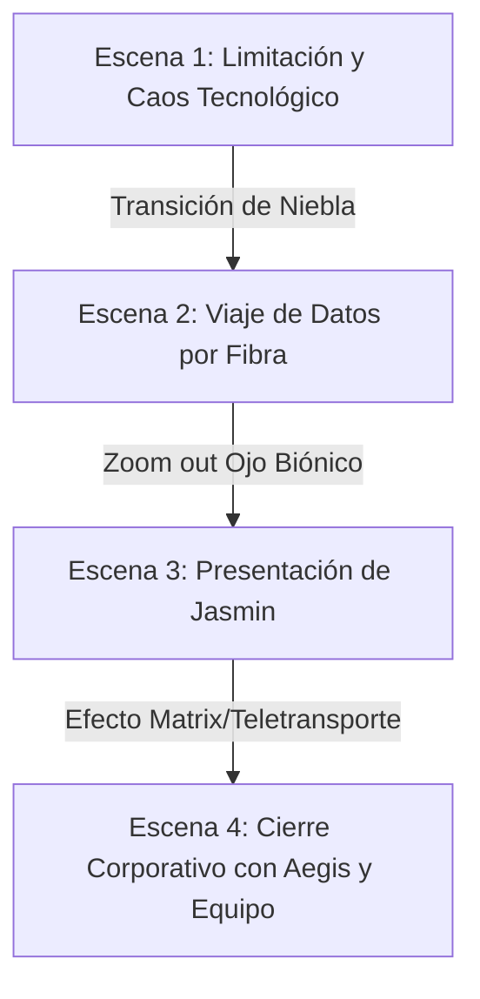

# Guía de Producción: Vídeo Demo "WM AI Systems"

Este vídeo está diseñado para ser una pieza de marketing B2B altamente cinematográfica y psicológica. No busca ser un simple tutorial, sino una demostración visual que marque un antes y un después en la forma en que los clientes ven la automatización y la inteligencia artificial.

---

## 🧠 Filosofía y Psicología de Ventas del Guion

Este guion ataca directamente una de las mayores frustraciones del mercado actual: **el agotamiento por la falsa IA y las herramientas obsoletas**.

1. **La limitación de la tecnología tradicional (El Robot Estresado)**:
   * Al usar un robot interactuando de forma caótica con 4 pantallas y 4 teclados, mostramos que incluso las herramientas automatizadas actuales tienen límites y causan estrés.
   * Representa la crítica a la tendencia actual de "falsas IAs" y "vendehumos" que prometen automatización pero acaban obligando al usuario a pelearse con prompts infinitos de ChatGPT, generando más confusión y trabajo. Intentar "dominar la tecnología" a la fuerza es un enfoque obsoleto.
2. **La fluidez de la autonomía real (La Fibra y los Rostros)**:
   * La transición limpia y rápida de la fibra óptica hacia el ojo biónico y los rostros humanos representa el paso de la fuerza bruta tecnológica a la **comprensión suave y fluida**.
   * Nuestros agentes autónomos trabajan en silencio, procesando millones de bytes de forma invisible. El usuario no tiene que pelearse con la IA.
3. **El enfoque "Human-in-the-top" (Validación Humana Superior)**:
   * Los agentes autónomos asumen la ejecución completa del trabajo pesado, dejando al ser humano en la posición óptima de control estratégico: **solo supervisar y validar el resultado final**, eliminando por completo la fricción operativa.

---

## 🎯 Estructura y Ritmo (Duración total: ~50-60 segundos)

---

## 📂 Recursos para el Editor (Acceso Rápido a los Avatares)

Para que el editor de vídeo o las herramientas de IA (Image-to-Video) mantengan la consistencia exacta de los personajes que se muestran en el sitio web, utiliza estos archivos originales del proyecto:

* 📁 **Carpeta de recursos**: [willmax-website/public/](file:///c:/Users/hachi/OneDrive/Escritorio/Hecate_Serveis/willmax-website/public)
* **Enlaces directos a los avatares**:
  * [Avatar de Jasmin](file:///c:/Users/hachi/OneDrive/Escritorio/Hecate_Serveis/willmax-website/public/jasmin.png) (Agente comercial / ciberseguridad)
  * [Avatar de Aegis](file:///c:/Users/hachi/OneDrive/Escritorio/Hecate_Serveis/willmax-website/public/aegis.png) (Líder / Arquitecto de IA)
  * [Avatar de Chloe](file:///c:/Users/hachi/OneDrive/Escritorio/Hecate_Serveis/willmax-website/public/chloe.png) (Agente de marketing y voz del vídeo)
  * [Avatar de Lili](file:///c:/Users/hachi/OneDrive/Escritorio/Hecate_Serveis/willmax-website/public/lili.png) (Agente de soporte y operaciones)
  * [Avatar de Lilith](file:///c:/Users/hachi/OneDrive/Escritorio/Hecate_Serveis/willmax-website/public/lilith.png) (Agente de diseño y analítica)
  * [Avatar de Edu](file:///c:/Users/hachi/OneDrive/Escritorio/Hecate_Serveis/willmax-website/public/edu.png) (Miembro del consorcio)
  * [Avatar de Pere](file:///c:/Users/hachi/OneDrive/Escritorio/Hecate_Serveis/willmax-website/public/pere.png) (Miembro del consorcio)

---

## FASE 1: Las Voces en Off (ElevenLabs)

Usaremos dos voces con tonos muy marcados en [ElevenLabs.io](https://elevenlabs.io/) (bajo la sección **Text to Speech**):

1. **Chloe (Voz Narradora Femenina)**: Cálida, analítica, pausada pero firme.
2. **Aegis (Voz Corporativa Masculina)**: Grave, con presencia, segura y tecnológica.

### Guion para el Audio 1 (`chloe_vo.mp3`):
> *"La era de la inteligencia artificial llegó para ayudarnos en las tareas más pesadas y repetitivas... Pero una nueva era está surgiendo, con una nueva generación de agentes. Ha nacido la nueva generación de agentes de inteligencia artificial para rendir la mayor autonomía y llevar la eficiencia a su máximo nivel. ¿Estás preparado para incorporar el máximo potencial de millones de bytes trabajando para ti?"*

### Guion para el Audio 2 (`aegis_vo.mp3`):
> *"Bienvenido a WM AI Systems. El futuro a tu servicio."*

---

## FASE 2: Prompts de Vídeo para IA (Kling AI / Runway Gen-3)

Introduce los siguientes prompts en inglés para obtener el mejor rendimiento de las herramientas generativas:

### Escena 1: El Caos de la Automatización Obsoleta (0:00 - 0:08)
* **Visual**: Robot estresado, interactuando frenéticamente con múltiples teclados y pantallas, transmitiendo el colapso del antiguo enfoque manual de la IA.
* **Prompt**:
  > `Sleek metallic humanoid robot sitting at a cluttered dark office desk, looking stressed and anxious. It is frantically staring at 4 glowing computer monitors while its metallic robotic hands type at lightning speed, alternating interaction with 4 physical keyboards. Cinematic moody lighting, photorealistic, 8k, slow motion zoom in.`
* **Transición de Niebla**:
  > `A thick, heavy digital cyan and dark grey fog slowly rises from the desk, engulfing the robot and the screens, completely covering the camera lens in a smooth transition.`

### Escena 2: Flujo Cuántico por Fibra Óptica (0:08 - 0:18)
* **Visual**: La niebla da paso al recorrido de datos limpios por fibra óptica hasta un cerebro digital.
* **Prompt**:
  > `The dark fog dissipates to reveal a cinematic macro shot of a glowing cyan and neon purple fiber optic cable running fast along a glossy black circuit board. The camera follows the speed of the light pulses. As it reaches a glowing connector node, it rapidly zooms out to reveal a detailed digital 3D glowing neural brain structure.`

### Escena 3: El Rostro Humano y el Ojo Biónico (0:18 - 0:28)
* **Visual**: Salida de zoom desde el ojo biónico al rostro de Jasmin con circuitos neon que desaparecen para dejar ver su cara humana y natural.
* **Prompt**:
  > `Close up of a glowing blue holographic hexagonal pattern inside a bionic eye. The camera swiftly zooms out through the pupil to reveal a stunning high-resolution, photorealistic close-up portrait of a professional female AI agent (Jasmin). Subtle glowing cyan neon circuit patterns appear on her face and cheeks for 2 seconds and then smoothly fade away, leaving a perfectly natural and confident human face looking directly into the camera. Premium corporate cyber aesthetic, studio lighting.`

### Escena 4: Consolidación y Teletransporte (0:28 - 0:46)
* **Visual**: El rostro de Aegis se forma como bits tipo Matrix y el resto del equipo se teletransporta a su lado estilo Star Trek.
* **Prompt (Aegis)**:
  > `Cinematic portrait of a mature male AI agent (Aegis), his face dynamically forming and assembling out of a beautiful organic swarm of glowing green and cyan digital bits and code matrix particles. The camera slowly tracks back as his face solidifies into a photorealistic, confident human face.`
* **Prompt (Equipo)**:
  > `A professional team of 3 diverse AI agents (two women, one man) materializing and teletransporting next to a male agent in a futuristic dark glass command center, using a sci-fi Star Trek style blue particle beam disintegrating effect. High-tech corporate lobby, cinematic lighting, wide shot.`

---

## FASE 3: Edición y Efectos de Sonido (CapCut)

Lleva todos los clips al editor (CapCut o Premiere) y ajústalos con este diseño de audio y tiempos:

| Tiempo | Video | Voz en Off | Diseño de Sonido (SFX) |
| :--- | :--- | :--- | :--- |
| **0:00 - 0:08** | **Robot estresado + Niebla**. | **Chloe**: *"La era de la IA llegó para ayudarnos en las tareas más pesadas..."* | Sonido de teclados ruidosos, alarmas lejanas. Cierra con un "whoosh" de aire con eco al entrar la niebla. |
| **0:08 - 0:18** | **Fibra óptica y cerebro**. | **Chloe**: *"...pero una nueva era está surgiendo con una nueva generación..."* | Silencio de ruidos. Se escucha un zumbido eléctrico limpio de alta frecuencia y un golpe sordo (sub-bass boom) al revelarse el cerebro. |
| **0:18 - 0:28** | **Zoom out del ojo a Jasmin**. | **Chloe**: *"...de agentes. Ha nacido la nueva generación de agentes para rendir la mayor autonomía..."* | Un barrido digital rápido ("whoosh" futurista). Un "bip" suave de confirmación cuando se desvanecen los neones de la cara. |
| **0:28 - 0:38** | **Formación de Aegis (Matrix)**. | **Chloe**: *"...y llevar la eficiencia a su máximo nivel. ¿Estás preparado para incorporar el máximo potencial de millones de bytes?"* | Sonido de lluvia de datos digital o "glitch" sintético suave mientras se acomodan los bits. |
| **0:38 - 0:46** | **Teletransporte del consorcio**. | **Aegis**: *"Bienvenido a WM AI Systems. El futuro a tu servicio."* | Sonido de rayo de energía o carga electromagnética que se consolida cuando aparece el equipo. |
| **0:46 - 0:52** | **Desvanecer al revés a Negro**. Logotipo de WM AI Systems con brillo. | *(Silencio)* | La música de fondo sube de volumen, se oye un eco tecnológico y termina en una nota sostenida que desaparece lentamente. |
