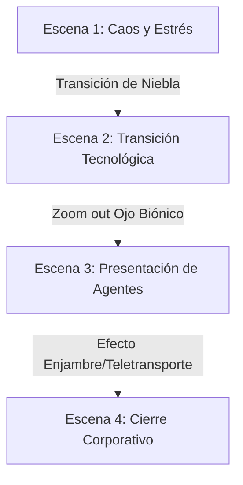

# Guía de Producción: Vídeo Demo "WM AI Systems"

Tu propuesta para el nuevo guion es espectacular. Es cinematográfica, dinámica y marca un contraste brutal entre la "automatización vieja y estresante" (el robot agobiado con 4 teclados) y la "autonomía del futuro" (nuestro consorcio de agentes de IA con aspecto humano y tecnología cuántica).

Aquí tienes la guía de producción actualizada paso a paso, con los textos exactos para las voces, los prompts listos para copiar en las IA de generación de vídeo, el diseño de sonido y las pautas de montaje en CapCut.

---

## 🎯 Estructura y Ritmo (Duración total: ~50-60 segundos)

El vídeo se divide en 4 escenas clave que guían al usuario desde el caos del trabajo mecánico hasta la paz y potencia de la hiper-eficiencia autónoma.

---

## FASE 1: Las Voces en Off (ElevenLabs)

Usaremos dos voces diferentes para este guion para darle contraste y realismo:
1. **Chloe (Voz Femenina)**: Cálida, analítica, narrativa y profesional.
2. **Aegis (Voz Masculina)**: Profunda, autoritaria, segura y tecnológica.

### Paso a Paso en ElevenLabs:
1. Entra en [ElevenLabs.io](https://elevenlabs.io/) y ve a **Text to Speech**.
2. **Audio 1 (Voz de Chloe)**: Selecciona una voz femenina descriptiva (ej. *Rachel* o *chloe* si tienes clonada). Pega el siguiente bloque de texto y descárgalo como `chloe_vo.mp3`:
   > *"La era de la inteligencia artificial llegó para ayudarnos en las tareas más pesadas y repetitivas... Pero una nueva era está surgiendo, con una nueva generación de agentes. Ha nacido la nueva generación de agentes de inteligencia artificial para rendir la mayor autonomía y llevar la eficiencia a su máximo nivel. ¿Estás preparado para incorporar el máximo potencial de millones de bytes trabajando para ti?"*
3. **Audio 2 (Voz de Aegis)**: Selecciona una voz masculina profunda y con eco corporativo (ej. *Marcus* o *Adam*). Pega el siguiente bloque de texto y descárgalo como `aegis_vo.mp3`:
   > *"Bienvenido a WM AI Systems. El futuro a tu servicio."*

---

## FASE 2: Prompts de Vídeo para IA (Kling AI / RunwayML)

Para generar los clips de vídeo usaremos plataformas como **Kling AI**, **Luma Dream Machine** o **Runway Gen-3**. Los prompts en inglés dan resultados de muchísima mayor calidad.

### Escena 1: El Caos de la Automatización Antigua
* **Acción**: Robot sentado en un escritorio agobiado por el trabajo, interactuando velozmente con 4 teclados y 4 pantallas.
* **Prompt IA**:
  > `Sleek metallic humanoid robot sitting at a cluttered dark office desk, looking stressed and anxious. It is frantically staring at 4 glowing computer monitors while its metallic robotic hands type at lightning speed, alternating interaction with 4 physical keyboards. Cinematic moody lighting, photorealistic, 8k, slow motion zoom in.`
* **Transición (Niebla)**:
  > `A thick, heavy digital cyan and dark grey fog slowly rises from the desk, engulfing the robot and the screens, completely covering the camera lens in a smooth transition.`

### Escena 2: El Viaje Cuántico (Fibra Óptica a Cerebro)
* **Acción**: La niebla se disipa y seguimos un haz de luz por fibra óptica hasta llegar al cerebro digital de un agente.
* **Prompt IA**:
  > `The dark fog dissipates to reveal a cinematic macro shot of a glowing cyan and neon purple fiber optic cable running fast along a glossy black circuit board. The camera follows the speed of the light pulses. As it reaches a glowing connector node, it rapidly zooms out to reveal a detailed digital 3D glowing neural brain structure.`

### Escena 3: El Nacimiento del Agente (Jasmin)
* **Acción**: El zoom del cerebro sigue retrocediendo saliendo a través del ojo biónico de un agente humano.
* **Prompt IA**:
  > `Close up of a glowing blue holographic hexagonal pattern inside a bionic eye. The camera swiftly zooms out through the pupil to reveal a stunning high-resolution, photorealistic close-up portrait of a professional female AI agent (Jasmin). Subtle glowing cyan neon circuit patterns appear on her face and cheeks for 2 seconds and then smoothly fade away, leaving a perfectly natural and confident human face looking directly into the camera. Premium corporate cyber aesthetic, studio lighting.`

### Escena 4: El Enjambre y el Equipo (Aegis + Teletransporte)
* **Acción**: Aegis se forma como un enjambre Matrix de bits, la cámara se aleja y aparece el resto del equipo estilo Star Trek.
* **Prompt IA (Aegis Matrix)**:
  > `Cinematic portrait of a mature male AI agent (Aegis), his face dynamically forming and assembling out of a beautiful organic swarm of glowing green and cyan digital bits and code matrix particles. The camera slowly tracks back as his face solidifies into a photorealistic, confident human face.`
* **Prompt IA (Equipo Teletransporte)**:
  > `A professional team of 3 diverse AI agents (two women, one man) materializing and teletransporting next to a male agent in a futuristic dark glass command center, using a sci-fi Star Trek style blue particle beam disintegrating effect. High-tech corporate lobby, cinematic lighting, wide shot.`

---

## FASE 3: Edición y Efectos de Sonido (CapCut)

Lleva todos los recursos (audios de ElevenLabs, vídeos generados por IA y el logo de la marca) a **CapCut** y colócalos en la línea de tiempo siguiendo este esquema de montaje:

### ⏱️ Línea de Tiempo del Montaje

| Tiempo (Seg) | Elemento Visual | Audio (Voz en Off) | Efectos de Sonido (SFX) |
| :--- | :--- | :--- | :--- |
| **0:00 - 0:08** | **Robot + 4 Teclados**. Zoom suave y rápido. Empieza a subir la niebla. | **Chloe**: *"La era de la IA llegó para ayudarnos en las tareas más pesadas..."* | Sonido de teclados mecánicos muy rápido, pitidos de alerta. Al final, sonido de ráfaga de aire/viento (whoosh) para la niebla. |
| **0:08 - 0:18** | **Niebla disipándose**. Recorrido de la fibra óptica hasta el cerebro. | **Chloe**: *"...pero una nueva era está surgiendo con una nueva generación..."* | El sonido de teclados desaparece. Se escucha un sonido de corriente eléctrica/energía viajando rápido y un pulso grave (boom) cuando llega al cerebro. |
| **0:18 - 0:28** | **Zoom out del ojo**. Rostro humano de Jasmin con líneas neon que se desvanecen. | **Chloe**: *"...de agentes. Ha nacido la nueva generación de agentes para rendir la mayor autonomía..."* | Efecto "Whoosh" digital al salir del ojo. Sonido sutil de "bip" tecnológico cuando se apagan las líneas de su rostro. |
| **0:28 - 0:38** | **Aegis enjambre Matrix**. Se solidifica su rostro. | **Chloe**: *"...y llevar la eficiencia a su máximo nivel. ¿Estás preparado para incorporar el máximo potencial de millones de bytes?"* | Sonido de código digital/computadora antigua procesando datos (estilo Matrix). |
| **0:38 - 0:46** | **Teletransporte del equipo**. Aparece el resto del consorcio de agentes. | **Aegis**: *"Bienvenido a WM AI Systems. El futuro a tu servicio."* | Sonido clásico de teletransportación de ciencia ficción (haz de luz brillante) y un pulso de graves potente. |
| **0:46 - 0:52** | **Desvanecer al revés (Invertido)**. El logo de **WM AI Systems** aparece sobre el fondo negro con un brillo. | *(Silencio de voz)* | Silencio de efectos, solo queda la música de fondo que sube un poco de volumen y termina con una nota sostenida. |

### 🎵 Música de Fondo Sugerida
Busca en CapCut o YouTube Audio Library música de estilo:
* **"Cyberpunk Ambient"** o **"Dark Synthwave"** (con un tempo lento pero con mucha presencia de graves y sintetizadores limpios).
* **Volumen**: Ajústala a **-18dB o -20dB** para que la voz en off se escuche nítida y al final súbela a **-10dB** para el cierre del logo.
